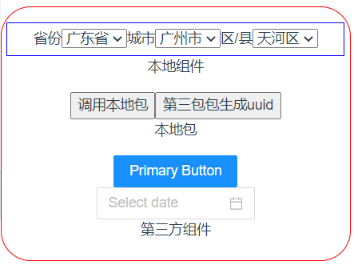
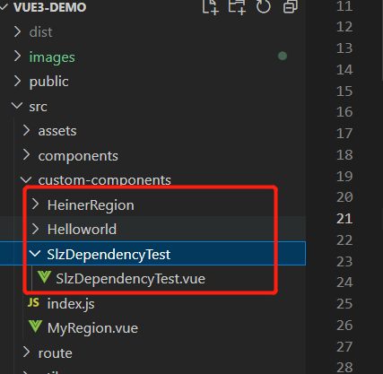

# 打包发布共享组件

## 背景

比如说我项目里面有个这样的组件，我也想方便的用到其他项目中：



那我的选择是把项目中的某个文件夹(我这里是custom-components)，下的所有组件打包成一个组件库，起名： vue3-demo-slz-component


## 第一步、开发组件

我已经开发好了三个组件在本地的custom-components文件夹




## 第二步、导出组件给外部引用

新建文件：src\custom-components\index.js

```
import SlzDependencyTest from "./SlzDependencyTest/SlzDependencyTest.vue"
import HeinerRegion from "./HeinerRegion/HeinerRegion.vue"

SlzDependencyTest.install = Vue => Vue.component(SlzDependencyTest.name, SlzDependencyTest);
HeinerRegion.install = Vue => Vue.component(HeinerRegion.name, HeinerRegion);

export{ SlzDependencyTest,HeinerRegion};
```

这里把SlzDependencyTest，HeinerRegion导出；


## 第三步、封装组件入口文件

新增文件: src/index.js

```
import {SlzDependencyTest,HeinerRegion} from "./custom-components";

export {
    SlzDependencyTest,HeinerRegion
}
```


新增文件：src\index.d.ts

```
#需和package.json -> name 一致
declare module 'vue3-demo-slz-component';
```

这个是避免ts模块警告的；


## 第四步、修改package.json

```
{
  "name": "vue3-demo-slz-component",
  "version": "0.3.0",
  "description": "slz组件库",
  "private": false,
  "main": "./src/index.js",
  "types": "./src/index.d.ts",
  "files": [ #你的组件引用的所有文件都填这里
    "src/custom-components/*",
    "src/index.js",
    "src/index.d.ts",
    "src/utils/*"
  ],
  ...
```


## 第五步、发布到npm作为一个组件库

```
#登录
npm set registry https://registry.npmjs.org/
npm login 

npm publish 
```


## 使用

其他项目直接：

```
npm i vue3-demo-slz-component
```

就可以用了
